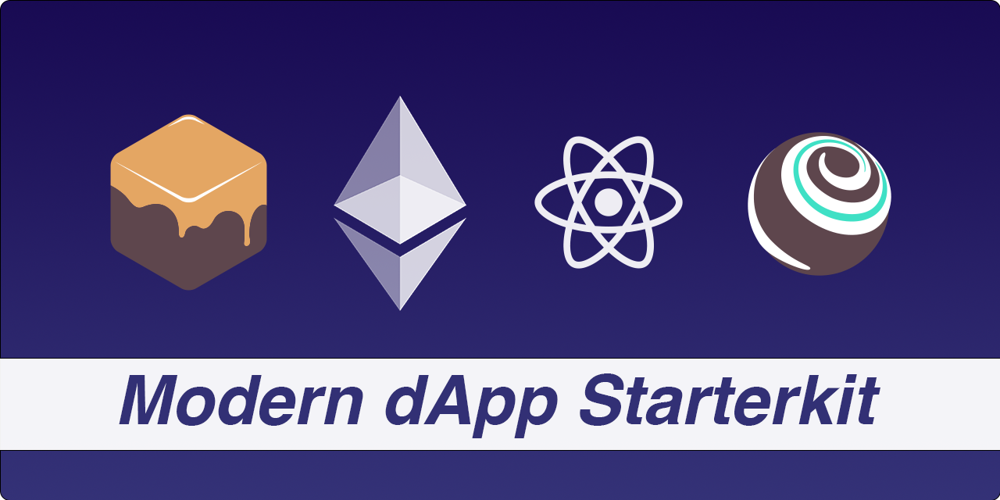

# Modern Etherum/React dApp Starterkit

A Solidity / TypeScript starter for truffle and react that includes all you need to build amazing **Blockchain dApps** 🔥

-   🔷 **Truffle** — Smart Contracts made sweeter
-   ⚛️ **React 17** — Latest react version based on [create-react-app](https://create-react-app.dev/docs/adding-typescript/)
-   💎 **Tailwind Css** — Rapidly build modern ui's without ever leaving your HTML
-   📏 **ESLint** — Pluggable JavaScript and TypeScript linter
-   🎨 **Prettier** - Opinionated Code Formatter
-   🐶 **Husky** — Modern native Git hooks made easy
-   📝 **Commitizen** - Zen-like commit messages for internet citizens
-   🚫 **lint-staged** - Run linters against staged git files

# 🚀 Getting started

## Dependencies

TODO: Add dependency docs.

---

## Ganache - one click blockchain

> Quickly fire up a personal Ethereum blockchain which you can use to run tests, execute commands, and inspect state while controlling how the chain operates.

1. Download and install the latest Ganache version for your OS from the [Official Ganache Website](https://www.trufflesuite.com/ganache).
2. Once Ganache is installed and opened click the **Quickstart Etherum** button and you're ready to go.

## Truffle / Smart Contracts

> Truffle is the most popular development framework for Ethereum with a mission to make your life a whole lot easier.

If you've successfully installed all the dependencies you're ready to compile and migrate your first Smart Contracts.

Use the following commands to compile and migrate your solidity contracts:

```
truffle compile
truffle migrate
```

## React-Client

To start the client you just need to run the following cmd inside of your project root directory:

```
npm start
```

... or if you prefer yarn:

```
yarn start
```

The project will be served at `http://localhost:3000`.

## 🔧 Testing

TODO: Add testing docs.
TODO: Write even more docs.

---

## 🤝 Contributing

1. Fork this repository
2. Create your branch: `git checkout -b my-feature`;
3. Commit your changes (pls use commitizen): `git cz`;
4. Push to the branch: `git push origin my-feature`.

**After your pull request is merged**, you can safely delete your branch.

## 📝 License

This project is licensed under the MIT License - see [LICENSE.md](LICENSE.md) for more information.
